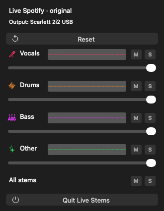

# Live Stems

**Separate the audio of any app on your Mac into vocals, drums, bass and everything else, live.**
Mute the vocals to study with instrumentals or sing along, solo the bass to learn a line, turn the
drums down to practice over them. It works while Spotify, Apple Music, a YouTube tab, VLC or any
other app is playing. Nothing is downloaded, prepared or saved: the separation happens as you listen.



Live Stems sits in your menu bar. Its panel has:

- a **source menu**: pick the app whose audio you want to split,
- one row per stem, like a Logic Pro track header: a **volume slider**, **M** (mute, blue) and
  **S** (solo, yellow) buttons, and a small **waveform** of what that stem is doing right now,
- an **All stems** row: **M** mutes everything, **S** lights up while anything is soloed (click it to
  clear every solo, like Logic),
- **Reset**, which puts every control back to normal.

## How it works

```
                       ┌─ Spotify
                       ├─ Apple Music
  the app you pick ────┼─ Chrome / Safari / YouTube
                       ├─ VLC, Logic
                       └─ any other app
                              │
                              ▼
                       macOS audio tap
                              │
                              ▼
                 last ~3 s, in memory only
                              │
                              ▼
          Demucs on your Mac's GPU, 10 times a second
                              │
                vocals · drums · bass · other
                              │
                              ▼
            your mix ──▶ speakers or headphones
```

1. **macOS hands Live Stems the sound of the app you picked**, the same way an equalizer or an audio
   visualizer gets it. Live Stems never opens the app's files or its stream.
2. **It keeps only the last few seconds**, in memory. Older audio is thrown away continuously.
3. **Ten times a second, the newest second goes through
   [Demucs](https://github.com/facebookresearch/demucs)**, Meta's music separation model, on your
   Mac's GPU. The model returns four stems.
4. **Your sliders remix the stems** and the result goes to your speakers or headphones, about a third
   of a second behind the app. The delay never changes, so you won't notice it.

If the model is ever late, that moment plays the parts of your mix that don't need stems instead of
glitching. When your mix is the plain song (every stem at the same volume) or the music is paused,
the model sleeps and your GPU rests.

## What Live Stems does not do

These are deliberate limits, not missing features:

- **It doesn't download, export or save audio or stems.** Only the last ~3 seconds exist, in memory.
- **It doesn't touch an app's files, cache, stream or copy protection.** It only hears what the app
  plays, through macOS.
- **It doesn't use any streaming service's API or SDK.** Spotify plays normally in its own app.
- **It doesn't train the model.** The model is used as downloaded (inference only).
- **Its logs hold timing numbers only**, never audio or song titles.

Streaming services' own terms of use still apply to how you use their content. This README is not
legal advice. Live Stems is meant for personal listening and practice; don't use it to copy or share
music.

## What you need

- A Mac with **Apple Silicon** running **macOS 26 or newer**. Built and tested on an **M3 Max**. The model
  must finish each job in under 0.1 s; on slower chips, stems may drop out to the plain song more often.
- **Python 3.12** (for example `brew install python@3.12`).
- Apple's **Command Line Tools**, to build the app (`xcode-select --install` if you don't have them).
- About **2 GB of disk space** for the model and its Python packages (the model download is about 1 GB),
  and about **1.5 GB of memory** while stems play (**under 1 GB** while the model sleeps).

## Install

Live Stems is built on your Mac from this source. Most of the time goes to downloads.
All commands go in **Terminal** (press ⌘-Space and type "Terminal").

### 1. Get the code

The app expects this folder layout, so clone it exactly like this:

```sh
mkdir -p ~/LiveStems/outputs ~/LiveStems/work
git clone https://github.com/benpham3206/live-stems.git ~/LiveStems/outputs/live-stems-source
cd ~/LiveStems
```

Every command below runs from `~/LiveStems`.

### 2. Set up Python and the model

```sh
python3.12 -m venv work/stems-venv
work/stems-venv/bin/pip install "demucs-mlx[convert]==1.5.3"
work/stems-venv/bin/python -m demucs_mlx.mlx_convert htdemucs_ft --output-dir work/model-cache
```

The last command downloads Meta's `htdemucs_ft` model (four fine-tuned models, one per stem) and
converts it for your GPU.

### 3. Make a signing certificate (one time)

macOS asks for permission to capture app audio. It only remembers your answer if every build of the
app has the same signature, so the app is signed with a certificate of your own:

1. Open **Keychain Access** and choose **Keychain Access > Certificate Assistant > Create a Certificate…**
2. Name it `Live Stems Local`, set **Certificate Type** to **Code Signing**, and click **Create**.
3. Save its ID for the build script:

```sh
security find-identity -p codesigning | grep -m1 "Live Stems Local" | awk '{print $2}' > work/live-stems-signing-identity.txt
```

The file must hold one 40-character ID. If the build later says *"A stable signing certificate is
required"*, check this file. If you already have an **Apple Development** certificate from Xcode, you
can use its ID instead (`security find-identity -p codesigning` lists them).

### 4. Build and open it

```sh
bash outputs/live-stems-source/script/build_and_run.sh
```

This builds the app, signs it, puts it in `/Applications/Live Stems.app` and opens it. When macOS asks
whether `codesign` may use your certificate, enter your Mac password and click **Always Allow**.
Run the same command again to update after `git pull`. The previous version is kept in `work/`.

## First launch

1. Open Live Stems and click **Stems** in the menu bar to show the panel.
2. Pick the app you're listening to in the **source menu**. Live Stems remembers it.
3. The first time, macOS asks to let Live Stems **record system audio**. Allow it. If the source is
   Spotify, macOS also asks to let it **control Spotify**, which it uses to notice pauses and skips.
4. Press any **M** or **S**, or move a slider.

Until you change the mix, the app plays straight to your speakers. When you first change it, Live
Stems takes over the app's sound at a moment where the switch can't be heard:

- **at a pause, a skip or a quiet moment** (a gap between songs, a quiet bar), if one comes within
  about 3 seconds;
- **Spotify:** otherwise it pauses Spotify for a blink, takes over in that silence and presses play
  again;
- **other apps:** otherwise it does a quick dip: the sound stops for about a third of a second and
  fades back in where it left off.

Nothing ever repeats or slows down. After that, any change to the mix fades in within about a second,
and switching headphones or speakers keeps Live Stems running.

## Using it

- **Move a slider, press M or S:** the stems fade in within a second.
- **Waveforms** show each stem's level before its slider. A muted stem still shows its waveform, dimmed.
  They are flat while the model sleeps.
- **The model sleeps when it isn't needed**, so your GPU and battery rest: when all four stems are at
  the same volume (untouched, all muted, or all at the same level), or when the music is paused. The
  status line tells you which: *Live stems*, *Original · model asleep*, *Muted · model asleep*.
- **Reset** returns every control to normal and brings the stem splitter back if it stopped.
- **Change the source** at any time in the source menu; Live Stems restarts on the new app.
- **Quit Live Stems** resets the mix and hands the sound back to the app at the next pause or quiet
  moment, so your music never cuts out.

## Something wrong?

| Problem | Try this |
|---|---|
| Build says *"A stable signing certificate is required"* | Redo [step 3](#3-make-a-signing-certificate-one-time). The ID file must hold one 40-character ID. |
| Build says *"The local Python environment is missing"* | Redo [step 2](#2-set-up-python-and-the-model). The folder layout from step 1 must match exactly. |
| macOS asks for audio permission after every update | The app's signature changed. Check that `work/live-stems-signing-identity.txt` still names your certificate. |
| No stems from a browser | Pick the browser itself in the source menu (not a tab). Live Stems also captures the browser's audio helper processes. |
| Status says *"… capture silent · direct playback restored"* | Spotify was silent for 10 seconds after Live Stems started. Play something, then change any control. |
| Stems drop out for a moment now and then | The GPU is busy with something else (games, video, editing apps). Live Stems plays the plain song for that moment rather than glitching. |
| The screen flickers and Live Stems stops | macOS restarted the GPU. Save the files named `gpuEvent-*` in `/Library/Logs/DiagnosticReports` and open an issue. |

Live Stems keeps small timing logs, never audio or song titles, in
`~/Library/Application Support/Live Stems/`. Each log is capped at 2 MB.

## Uninstall

1. Choose **Quit Live Stems** in the panel.
2. Move `/Applications/Live Stems.app`, `~/Library/Application Support/Live Stems` and `~/LiveStems` to the Trash.
3. Optional: delete the `Live Stems Local` certificate in **Keychain Access**, and remove Live Stems under
   **System Settings > Privacy & Security** (Screen & System Audio Recording, and Automation).

## Under the hood

The interesting part isn't the model, it's running an offline separator live: rolling one-second
windows, playback deadlines, stand-in estimates when a result is late, crossfades between estimates,
skip and pause detection, a bounded history, and one fixed playback clock that never rewinds or
drifts (about 0.31 s from capture to speaker). The design, numbers and test plan are in
[docs/internals.md](docs/internals.md).

To check a change, run `bash outputs/live-stems-source/script/verify.sh` from `~/LiveStems`. It builds
the app and runs the checks that need no GPU, signing or audio permission. Exit 0 means they passed.

## Credits and disclaimer

Live Stems is an unofficial personal project by Ben Pham. It isn't affiliated with, endorsed by, or
sponsored by Spotify, Apple, Google, Meta or any other company whose app it can hear. Names are
trademarks of their owners.

Separation uses [Demucs](https://github.com/facebookresearch/demucs) by Meta AI Research and its
MLX port [demucs-mlx](https://github.com/ssmall256/demucs-mlx). The model weights are downloaded from
their official source during install. They are not part of this repository.

Live Stems relies on macOS audio taps; a macOS update could break it.
